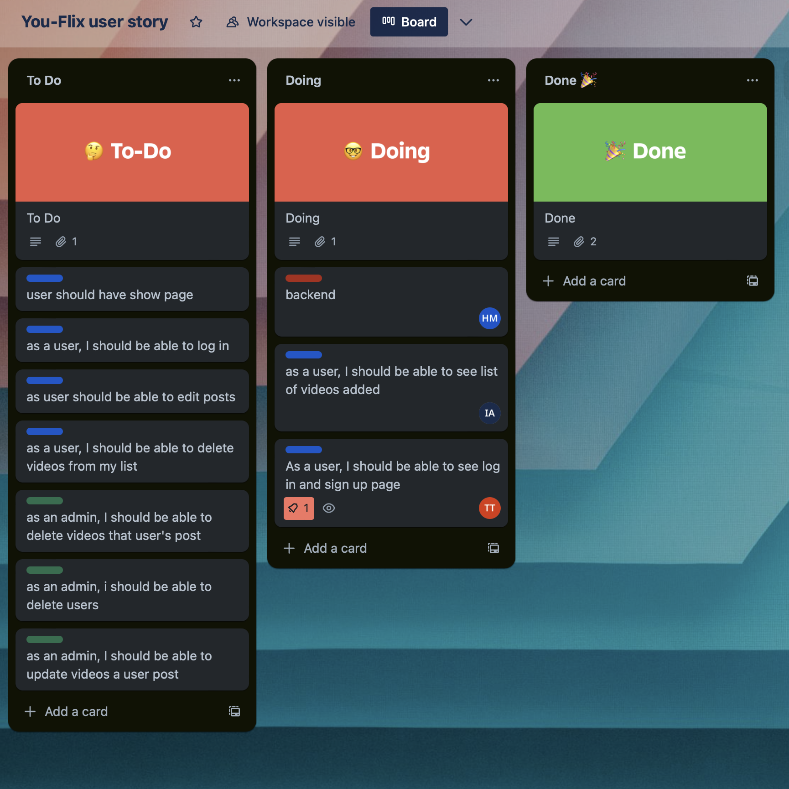

# YOU-FLIX

In this group project, we used REACT ROUTER to create the frontend of the application. 

<!--Table of Contents-->
Table of Contents
<ol>
  <li>
    <a href= "#You-Flix">You-Flix </a>
    <ul>
      <li><a href="#Built-with"> Built With</a></li>
    </ul>
    </li>
    <li>
      <a href="#approach-taken">Approach Taken</a>

  <li><a href="#installation-instructions">Installation Instructions</a></li>
<li><a href="#wire-frames">Wire Frames</a></li>       

</ol>

<!--About the Project-->
# You-Flix

You-Flix was created as a simple user-friendly app that allows users to upload their videos. This app allows users to create a profile that keeps track of their uploaded videos. In their profile, they can create, delete or update any of their videos.

### Built With
This is a full stack app that was built using Javascript, React, CSS, HTML and full CRUD data operations. We used Trello to organize our ideas and keep track of the steps we had to complete.

(<a href="#top">back to top</a>)

### Approach Taken
In the frontend of the project, we set up the components and pages folders. Within these folders, we set up files that allowed us to create different pages that allowed users to navigate through the app. We also added styling to make the app looking appealing to the user. 

### Installation 
Open application in browser or download the application and start creating a collection of videos.

(<a href="#top">back to top</a>)

### Wireframes

(<a href="#top">back to top</a>)

